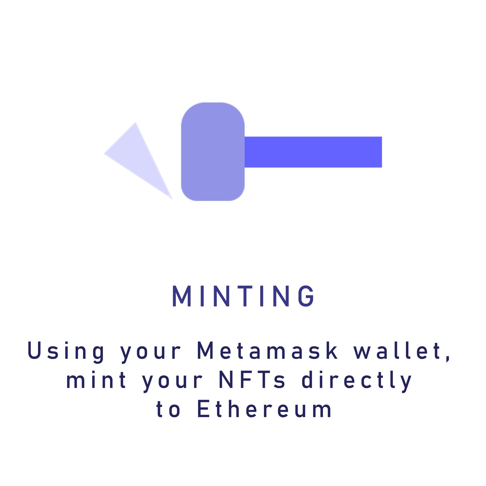
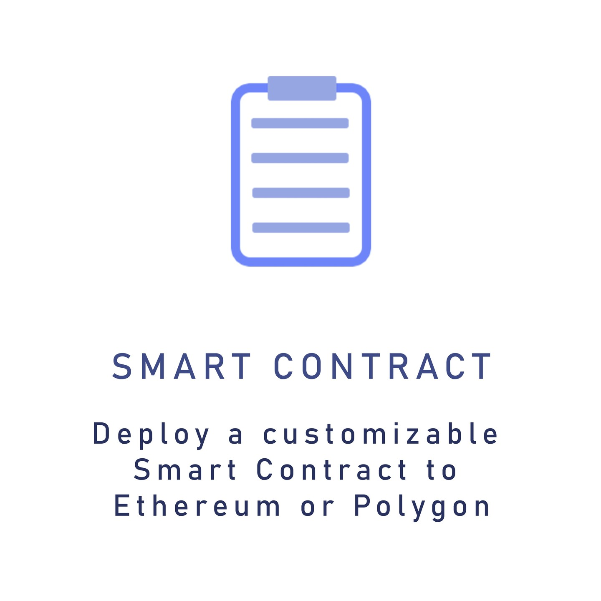
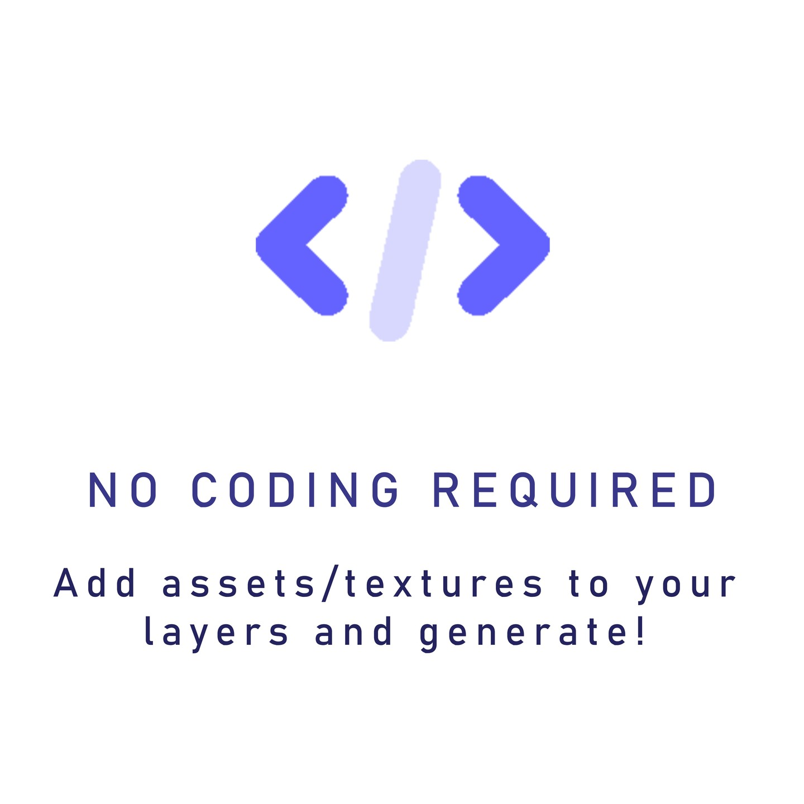
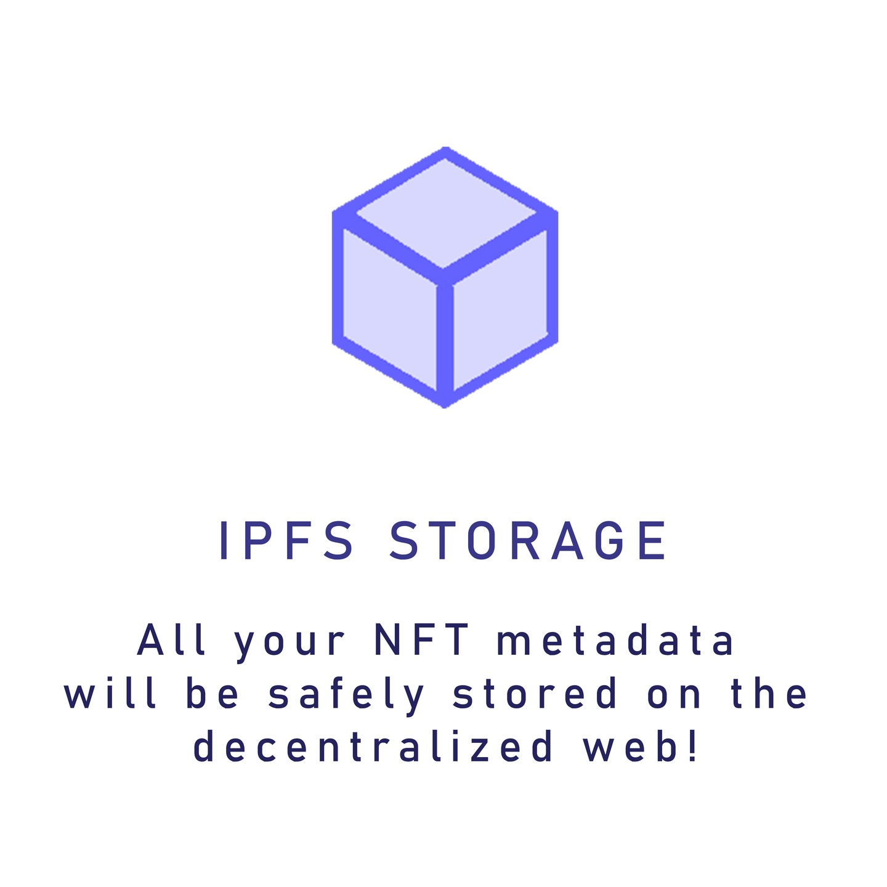
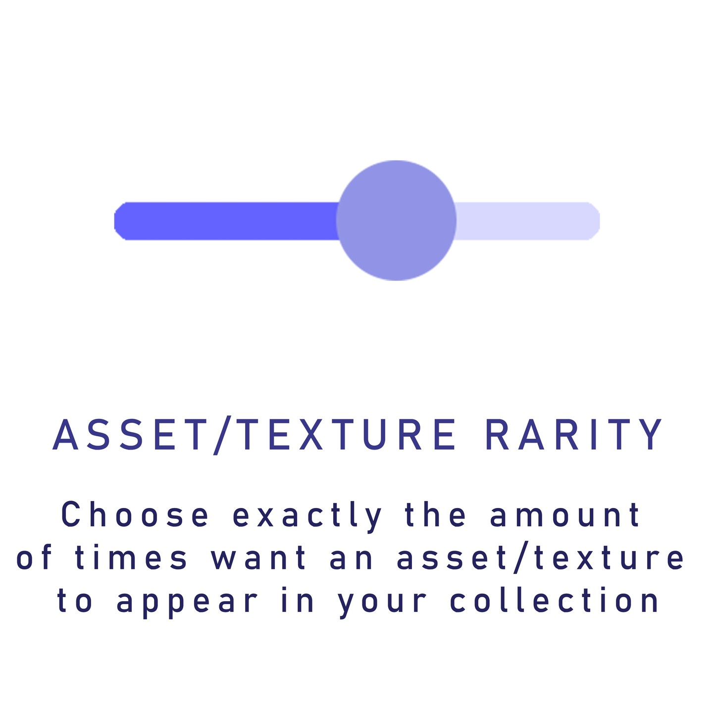
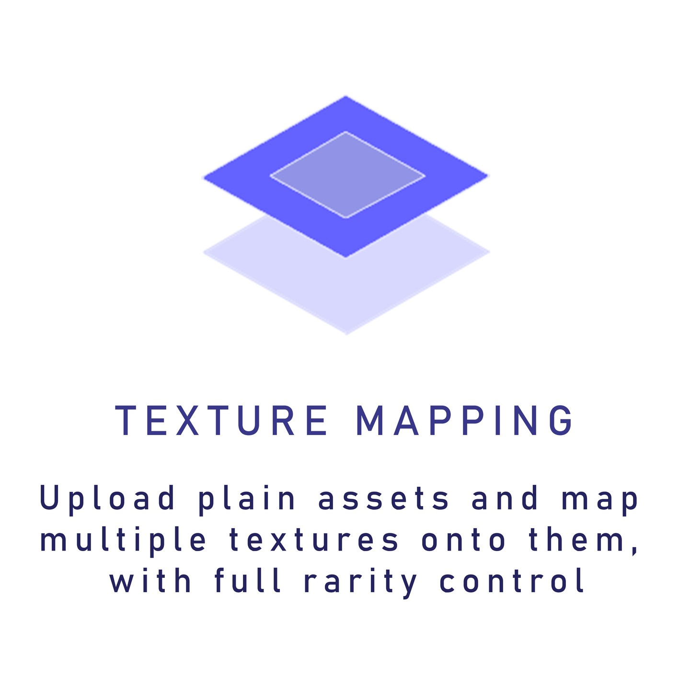
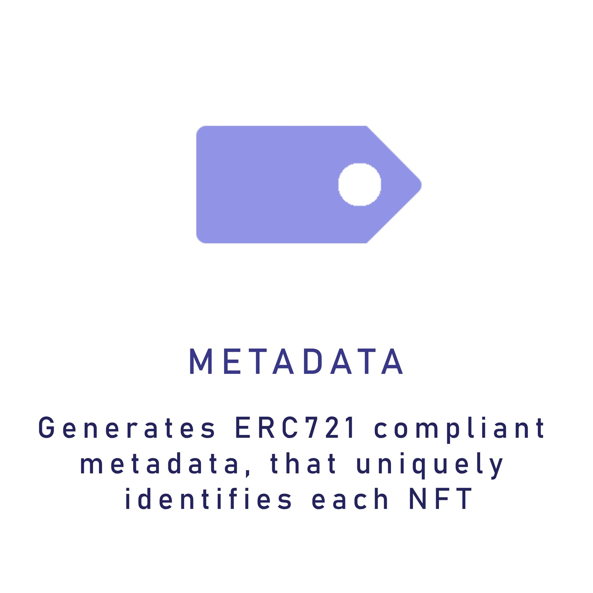
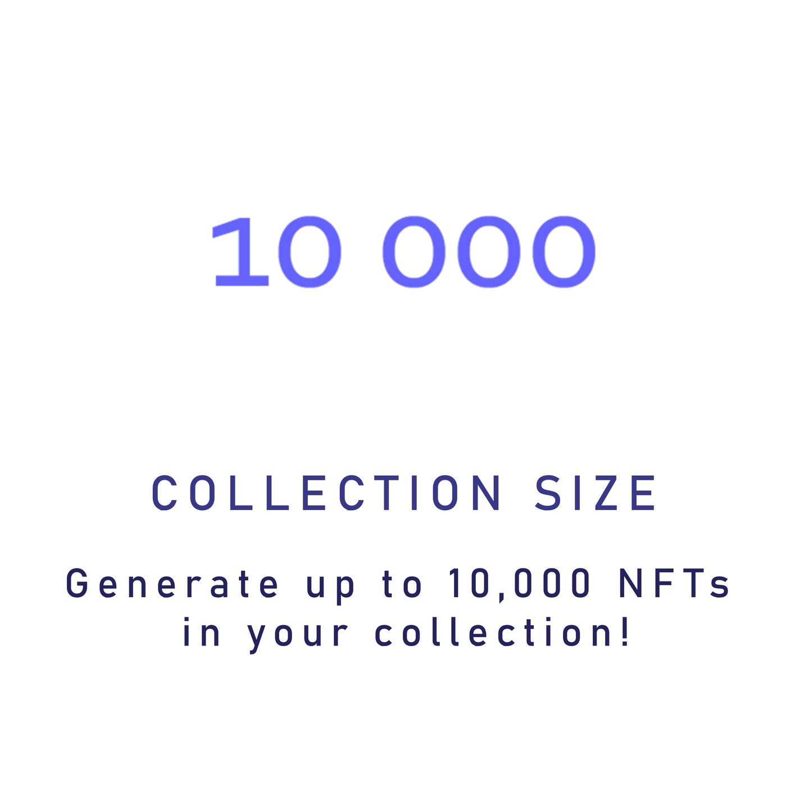
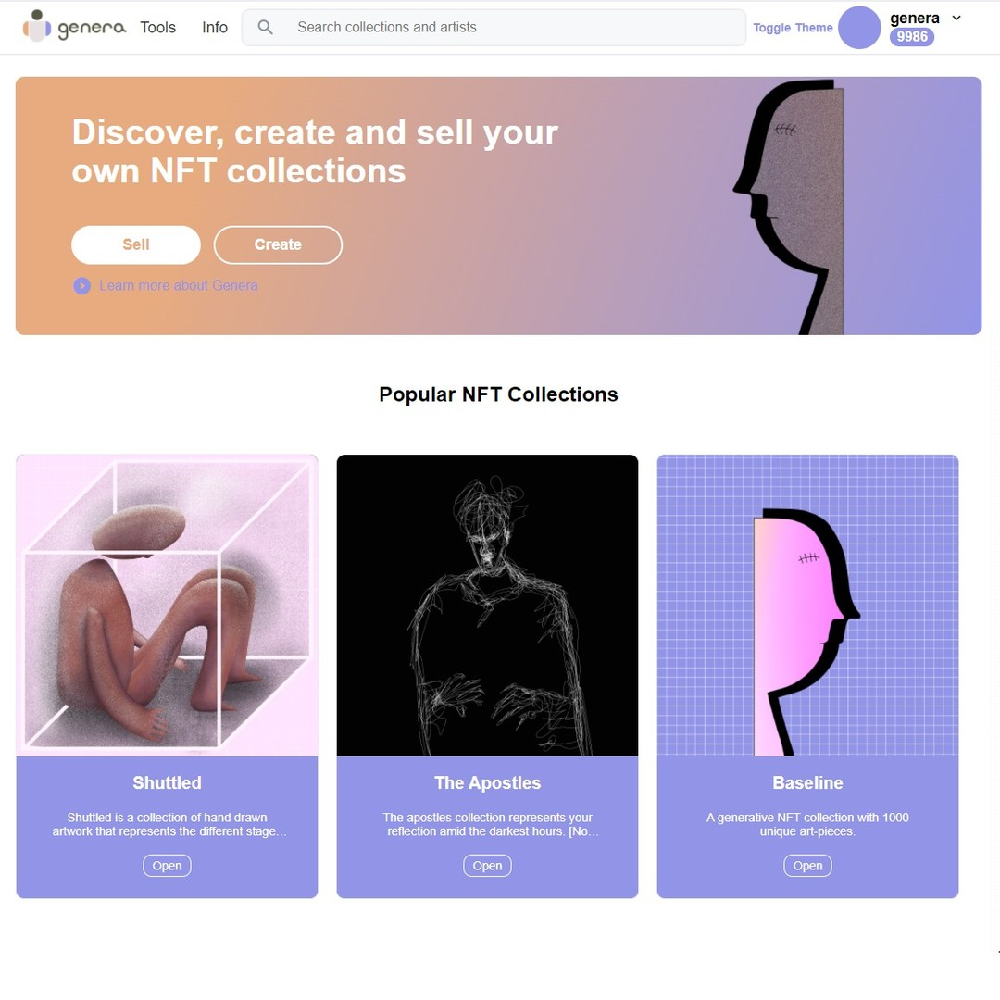
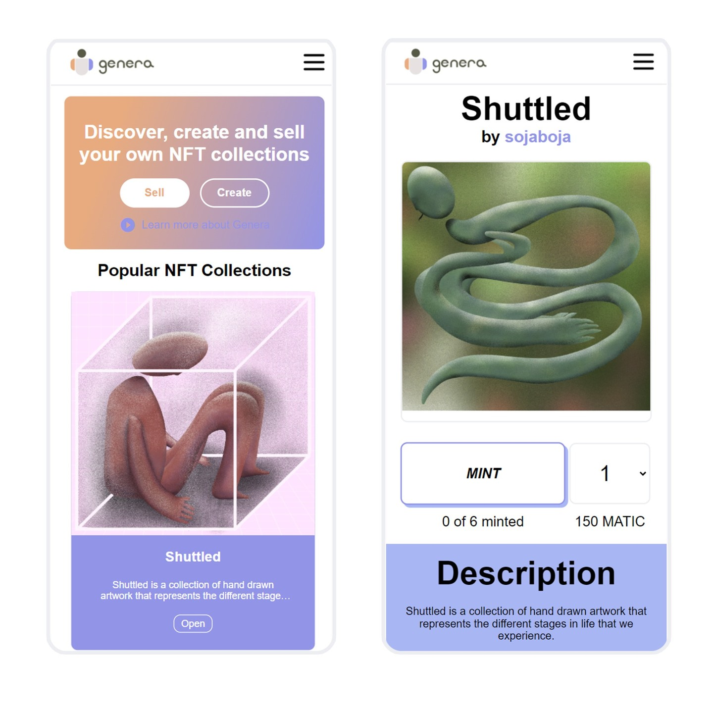

    <picture>
      
    </picture>
    <h1 align="center">Genera</h1>

  

## What is Genera

Discover create and sell your own NFT collections

## Features

    <picture>
      
    </picture>
    <picture>
      
    </picture>
    <picture>
      
    </picture>
    <picture>
      
    </picture>
    <picture>
      
    </picture>
    <picture>
      
    </picture>
    <picture>
      
    </picture>
    <picture>
      
    </picture>
    <picture>
      
    </picture>
    <picture>
      
    </picture>
    

## HomePage

    <picture>
      
    </picture>
    <picture>
      
    </picture>

